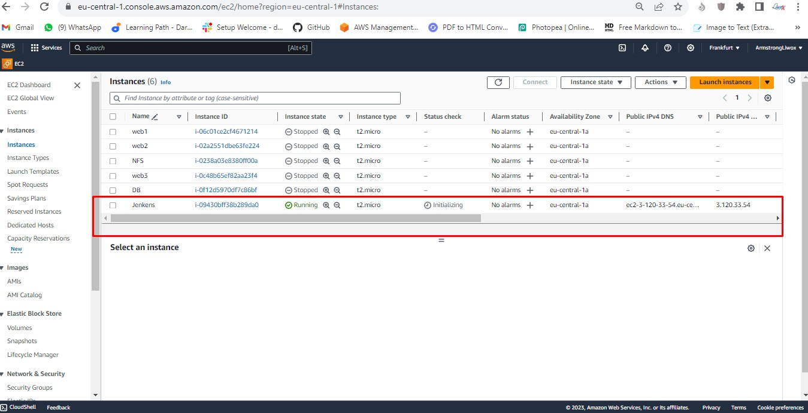

# Ansible-Automate-Project - Armstrong

## Ansible-Automate Project Ansible Configuration Management - Automate Project 7 to 10

> What is Ansible and why use IT?

Ansible is an open source, command-line IT automation software application written in Python. 

It can configure systems, deploy software, and orchestrate advanced workflows to support application deployment, system updates, and more. 

Ansible's main strengths are simplicity and ease of use.

> Ansible is an automation engine that helps us to automate tasks that are cumbersome, repititive and complex.
 It makes work easier for the DevOps department. 

> Ansible Client as a Jump Server (Bastion Host)

A Jump Server (sometimes also referred as Bastion Host) is an intermediary server through which access to internal network can be provided. 

With the current architecture I will be working on, ideally, the webservers would be inside a secured network which cannot be reached directly from the Internet. 

That means, even DevOps engineers cannot SSH into the Web servers directly and can only access it through a Jump Server - it provides better security and reduces attack surface.

On the diagram below the Virtual Private Network (VPC) is divided into two subnets - Public subnet has public IP addresses and Private subnet is only reachable by private IP addresses.


## What is configuration management?

Configuration management is a process for maintaining computer systems, servers, applications, network devices, and other IT components in a desired state. It’s a way to help ensure that a system performs as expected, even after many changes are made over time. 

Using configuration management tools, administrators can set up an IT system, such as a server or workstation, then build and maintain other servers and workstations with the same settings. IT teams use configuration assessments and drift analyses to continuously identify systems that have strayed from the desired system state and need to be updated, reconfigured, or patched.

https://www.redhat.com/en/topics/automation/what-is-configuration-management#:~:text=Configuration%20management%20is%20a%20process,in%20a%20desired%2C%20consistent%20state.&text=Managing%20IT%20system%20configurations%20involves,building%20and%20maintaining%20those%20systems.


## Install and configure ansible on ec2 instance

## Step 1 - Install and Configure Ansible on EC2 Instance

1. Update the Name tag on your Jenkins EC2 Instance to Jenkins-Ansible. We will use this server to run playbooks.




https://www.jenkins.io/doc/book/installing/linux/#debianubuntu


```
c3afcdc699134aeba62a8eead05fca4f
```


2. In your GitHub account create a new repository and name it ansible-config-mgt.


https://github.com/ArmstrongLiwox/ansible-config-mgt.git

3. Install Ansible (see: install Ansible with pip)

```
sudo apt update
```
```
sudo apt install ansible
```
> Check your Ansible version by running
```
ansible --version
```


## 4. Configure Jenkins build job to archive your repository content every time you change it 

> this will solidify your Jenkins configuration skills acquired in Project 9.


### Create a new Freestyle project ```ansible``` in Jenkins and point it to your 'ansible-config-mgt' repository.


### Configure a webhook in GitHub and set the webhook to trigger ```ansible``` build.


### Configure a Post-build job to save all (**) files.

```
jenkins-plugin-cli --plugins strict-crumb-issuer:2.1.1
```


### 5. Test your setup by making some change in README.md file in *master branch* and make sure that builds starts automatically and Jenkins saves the files (build artifacts) in following folder


```
ls /var/lib/jenkins/jobs/ansible/builds/<build_number>/archive/
```

```
sudo ls /var/lib/jenkins/jobs/Ansible/builds/3/archive/
```

Note: Trigger Jenkins project execution only for main (or master) branch.


```
sudo cat /var/lib/jenkins/jobs/Ansible/builds/3/archive/README.md
```


Now the setup will look like this:


> Tip: Every time you stop/start your Jenkins-Ansible server - you have to reconfigure GitHub webhook to a new IP address, in order to avoid it, it makes sense to allocate an Elastic IP to your Jenkins-Ansible server. 

> Note that Elastic IP is free only when it is being allocated to an EC2 Instance, so do not forget to release Elastic IP once you terminate your EC2 Instance.


## Step 2 - Prepare your development environment using Visual Studio Code

1. Here we are require to write some codes with proper tools that will make coding and debugging comfortable - we need an Integrated development environment (IDE) or Source-code Editor. 

we will use Visual Studio Code (VSC).


2. I will configure to connect to the newly created GitHub repository.

3. Clone down your ansible-config-mgt repo to your Jenkins-Ansible instance

```
git init
```

```
git clone <ansible-config-mgt repo link>
```


# Begin ansible development

## Step 3 - Begin Ansible Development

1. In your ansible-config-ngt GitHub repository, create a new branch that will be used for development of a new feature.
Tip: Give your branches descriptive and comprehensive names, for example, if you use Jira or Trello as a project management tool - include ticket number (e.g. PRJ-145 ) in the name of your branch and add a topic and a brief description what this branch is about-a bugfix, hotfix, feature, release (e.g. feature/prj-145-1vm)

2. Checkout the newly created feature branch to your local machine and start building your code and directory structure

3. Create a directory and name it playbooks - it will be used to store all your playbook files.

4. Create a directory and name it inventory - it will be used to keep your hosts organised.

5. Within the playbooks folder, create your first playbook, and name it common.yml

6. Within the inventory folder, create an inventory file () for each environment (Development, Staging Testing and Production) dev staging respectively. These inventory files use .ini languages style to configure Ansible hosts.


### Step 4 - Set up an Ansible Inventory
uat, and prod

An Ansible inventory file defines the hosts and groups of hosts upon which commands, modules, and tasks in a playbook operate. Since our intention is to execute Linux commands on remote hosts, and ensure that it is the intended configuration on a particular server that occurs. It is important to have a way to organize our hosts in such an Inventory.
Save the below inventory structure in the inventory/dev file to start configuring your development servers. Ensure to replace the IP addresses according to your own setup.

Note: Ansible uses TCP port 22 by default, which means it needs to ssh into target servers from Jenkins-Ansible host - for this you can implement the concept of ssh- agent. Now you need to import your key into ssh-agent:

To learn how to setup SSH agent and connect VS Code to your Jenkins-Ansible instance, please see this video:

• For Windows users - ssh-agent on windows

• For Linux users - ssh-agent on linux


```
eval `ssh-agent -s`
```


```
ssh-add <path-to-private-key>
```

```
ssh-add nfs.pem
```

```
ssh-add C:\Users\user\Documents\documents\key\NFS\nfs.pem
```


> persist the key on the server

> Confirm the key has been added with the command below, you should see the name of your key

```
ssh-add -l
```


> Now, ssh into your Jenkins-Ansible server using ssh-agent

```
ssh -A ubuntu@3.120.33.54
```


> learn how to setup SSH agent and connect VS Code to your Jenkins-Ansible instance

Also notice, that your Load Balancer user is ```ubuntu``` and user for RHEL-based servers is ```ec2-user```
Update your ```inventory/dev.yml``` file with this snippet of code:

```
[nfs]
<NFS-Server-Private-IP-Address> ansible_ssh_user=ec2-user

[webservers]
<Web-Server1-Private-IP-Address> ansible_ssh_user=ec2-user
<Web-Server2-Private-IP-Address> ansible_ssh_user=ec2-user

[db]
<Database-Private-IP-Address> ansible_ssh_user=ec2-user 

[lb]
<Load-Balancer-Private-IP-Address> ansible_ssh_user=ubuntu
```


> Check if I can connect into any of the new servers just created (using the same key) 


> populate the dev.yml file with IP addresses of servers

```
[J-NFS]
172.31.29.51 ansible_ssh_user='ec2-user'

[J-Web1]
172.31.23.13 ansible_ssh_user='ec2-user'

[J-Web2]
172.31.19.199 ansible_ssh_user='ec2-user'

[J-DB]
172.31.20.112 ansible_ssh_user='ec2-user' 

[J-LB]
172.31.23.19 ansible_ssh_user='ubuntu'
```


# Create a common playbook

## Step 5 - Create a Common Playbook

It is time to start giving Ansible the instructions on what you need to be performed on all servers listed in inventory/dev.

In ```common.yml``` playbook you will write configuration for repeatable, re-usable, and multi-machine tasks that is common to systems within the infrastructure.

Update your ```playbooks/common.yml``` file with following code:

```
---
- name: update web, nfs and db servers
  hosts: webservers, nfs, db
  become: yes
  tasks:
    - name: ensure wireshark is at the latest version
      yum:
        name: wireshark
        state: latest
   

- name: update LB server
  hosts: lb
  become: yes
  tasks:
    - name: Update apt repo
      apt: 
        update_cache: yes

    - name: ensure wireshark is at the latest version
      apt:
        name: wireshark
        state: latest
```

```
---
- name: update J-Web1, J-Web2,  J-NFS, and J-DB servers
  hosts: J-Web1, J-Web2, J-NFS, J-DB
  remote_user: ec2-user
  become: yes
  become_user: root
  tasks:
    - name: ensure wireshark is at the latest version
      yum:
        name: wireshark
        state: latest
   

   #=============================================

- name: update J-LB server
  hosts: J-LB
  remote_user: ubuntu
  become: yes
  become_user: root
  tasks:
    - name: Update apt repo
      apt: 
        update_cache: yes

    - name: ensure wireshark is at the latest version
      apt:
        name: wireshark
        state: latest
```


Examine the code above and try to make sense out of it. 

This playbook is divided into two parts, each of them is intended to perform the same task: 

install wireshark utility (or make sure it is updated to the latest version) on your RHEL 8 and Ubuntu servers. 

It uses root user to perform this task and respective package manager: yum for RHEL 8 and apt for Ubuntu.

Feel free to update this playbook with following tasks:

• Create a directory and a file inside it

• Change timezone on all servers

• Run some shell script

Get a better understanding of Ansible playbooks. 
https://www.redhat.com/en/topics/automation/what-is-an-ansible-playbook

## Step 6 - Update GIT with the latest code

Now all of your directories and files live on your machine and you need to push changes made locally to GitHub.

In the real world, you will be working within a team of other DevOps engineers and developers. 

It is important to learn how to collaborate with help of GIT. 

In many organisations there is a development rule that do not allow to deploy any code before it has been reviewed by an extra pair of eyes - it is also called "Four eyes principle".

Now you have a separate branch, you will need to know how to raise a Pull Request (PR), get your branch peer reviewed and merged to the master branch.

Commit your code into GitHub:

1. Use git commands to add, commit and push your branch to GitHub.

```
git status
```
```
git add <selected files>
```
```
git commit -m "commit message"
```


2. Create a Pull request (PR)


3. Wear the hat of another developer for a second, and act as a reviewer.


4. If the reviewer is happy with your new feature development, merge the code to the master branch.


5. Head back on your terminal, checkout from the feature branch into the master, and pull down the latest changes.


Once your code changes appear in master branch - Jenkins will do its job and save all the files (build artifacts) to


```
/var/lib/jenkins/jobs/ansible/builds/<build_number>/archive/
``` 

```
sudo ls /var/lib/jenkins/jobs/Ansible/builds/4/archive
```

directory on ```Jenkins-Ansible``` server.

> confirm files in ansible server


# Run first ansible test

## Step 7 - Run first Ansible test

Now, it is time to execute ```ansible-playbook``` command and verify if your playbook actually works:

1. Setup your VSCode to connect to your instance as demonstrated by the video above. 
Now run your playbook using the command:


```
# Read more about SSH config files: https://linux.die.net/man/5/ssh_config
Host Jenkens-Ansible
    HostName 3.120.33.54
    User ubuntu
    IdentityFile C:\Users\user\Documents\documents\key\NFS
    ForwardAgent yes
    ControlPath /tmp/ansible-ssh-%h-%p-%r
    ControlMaster auto
    ControlPersist 10m
```


```
cd ansible-config-mgt
```
```
ansible-playbook -i inventory/dev.yml playbooks/common.yml
```

ansible-playbook -i inventory/dev.yml playbooks/common.yml

```
ansible-playbook -i /var/lib/jenkins/jobs/Ansible/builds/4/archive/inventory/dev.yml /var/lib/jenkins/jobs/Ansible/builds/4/archive/playbooks/common.yml
```


# HURRAY !!!

> Note: Make sure you're in your ```ansible-config-mgt``` directory before you run the above command.
You can go to each of the servers and check if ```wireshark``` has been installed by running 

```
which wireshark
``` 

or 

```
wireshark version
```


# SUCCESS !!!

The architecture looks like this:


## Optional step - Repeat once again

Update your ansible playbook with some new Ansible tasks and go through the full checkout -> change codes -> commit -> PR -> merge -> build -> ansible-playbook cycle again to see how easily you can manage a servers fleet of any size with just one command!
Congratulations

You have just automated your routine tasks by implementing your first Ansible project! There is more exciting projects ahead, so lets keep it moving!

